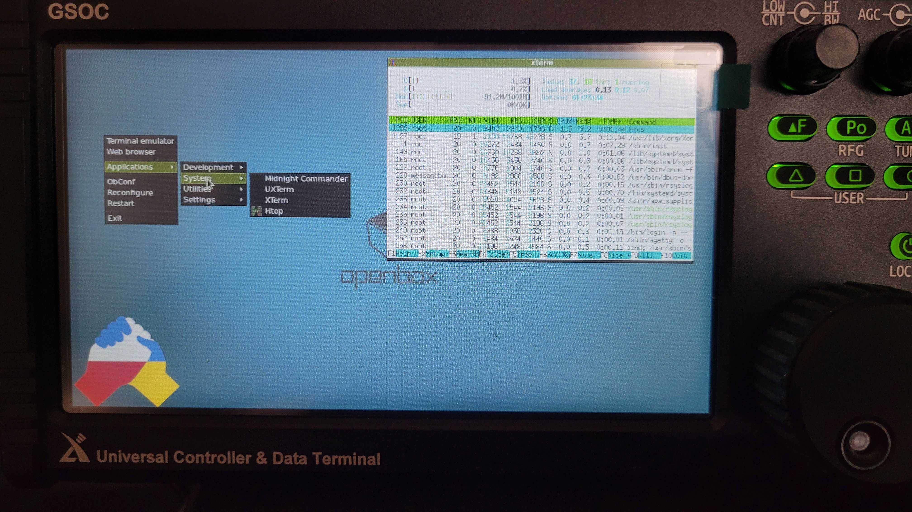

# gsoc-puhumod

Xiegu GSOC Debian hack a.k.a **puhuMod**. puhu originated from "**путін хуй**".

THE SOFTWARE IS PROVIDED "AS IS", WITHOUT WARRANTY OF ANY KIND, EXPRESS OR 
IMPLIED, INCLUDING BUT NOT LIMITED TO THE WARRANTIES OF MERCHANTABILITY, FITNESS
 FOR A PARTICULAR PURPOSE AND NONINFRINGEMENT. IN NO EVENT SHALL THE AUTHORS OR 
COPYRIGHT HOLDERS BE LIABLE FOR ANY CLAIM, DAMAGES OR OTHER LIABILITY, WHETHER 
IN AN ACTION OF CONTRACT, TORT OR OTHERWISE, ARISING FROM, OUT OF OR IN 
CONNECTION WITH THE SOFTWARE OR THE USE OR OTHER DEALINGS IN THE SOFTWARE.



Since Xiegu seems to have abandoned the GSOC, and I no longer own my G90, this
fork was created to use the GSOC as a Ham Clock in my shack.  If you have a GSOC
laying around a Ham Clock is a great use for it.

This mod requires Xiegu GSOC firmware update image v1.3.

= Getting Started

## 1.  Prepare your boot media.  
Follow the instructions for [SD Card](sdcard_boot/README.md) or [USB](usb_boot/README.md)

## 2.  [Create the Debian installation.](debian/README.md)

## 3. First run

The Default user is 'hamclock' with a password of 'hamclock.'  The default root password is set to `gsoc`.

### Important
The GSOC will run a script to install kernel modules from the GSOC's main storage and automatically reboot on the first boot.

## 4.  Network Configuration
After the kernel modules install, the GUI will load and you will be prompted to configure wifi.  Use the menu-driven 'nmtui' interface to get connected.  This will only launch on the first boot.  If you need to access this again, or it doesn't automatically launch, minimize the hamclock application, right-click anywhere and click "Terminal Emulator."  From there you can type:

```
nmtui
```
### Wifi hardware

Ammount of supported hardware is limited at this moment. Please take a look 
at `/lib/modules` to find out what might work. Cards with chipsets other than
Realtek won't work. I can confirm that TP-Link TL-WN821N works.
(https://www.amazon.pl/gp/product/B00194XKXA/)

## 5. HamClock configuation
Once the network is up and running, close the nmtui window and configure HamClock as usual.

## A note about screen resolution
The GSOC uses a screen resolution of 1024x600.  There is not a build of hamclock for this resolution, so the 800x480 build is used.  This results in black bars around the interface and wasted screen real-estate.  If I have time in the future I may try to update the application to work better with the GSOC's internal display.

73 and have fun!
